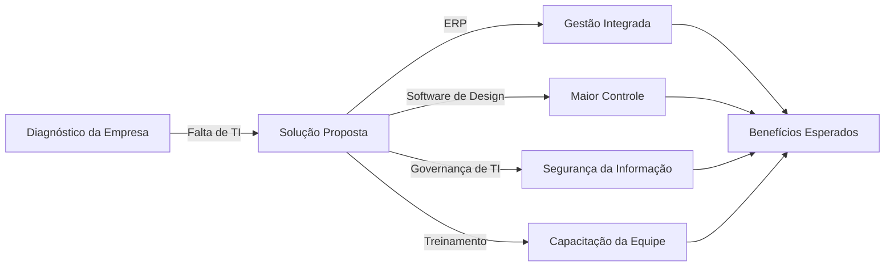

# 📌 Implementação da Governança e Gestão de TI na Empresa de Móveis

## 📌 Introdução
A empresa enfrenta desafios devido à ausência de Tecnologia da Informação (TI) em seus processos. O controle manual de compras e vendas, além da terceirização do design dos móveis, reduz a eficiência e a competitividade no mercado. 

O objetivo é estruturar uma governança e gestão de TI eficientes, garantindo melhor controle, produtividade e segurança.

---

## 📌 Diagnóstico da Empresa
✅ **Falta de um sistema informatizado**: Dependência de papel para controle de compras e vendas.  
✅ **Desenhos dos móveis terceirizados**: Dificuldade em inovar e reduzir custos.  
✅ **Ausência de Governança de TI**: Falta de processos bem definidos e segurança da informação.  

---

## 📌 Solução Proposta

### 🚀 1. Implementação de um Sistema Integrado de Gestão (ERP)
✔ Digitalização do controle de compras, vendas e estoque.  
✔ Redução de erros e desperdícios.  
✔ Geração de relatórios em tempo real para tomada de decisão.  

### 🎨 2. Uso de Software de Design de Móveis
✔ Implementação de programas como **SketchUp** ou **AutoCAD**.  
✔ Maior controle sobre os projetos e possibilidade de customização.  
✔ Redução de custos com terceirização.  

### 🏢 3. Estruturação da Governança e Gestão de TI
✔ Definição de papéis e responsabilidades na equipe de TI.  
✔ Implementação de normas de segurança da informação.  
✔ Adoção de boas práticas como **ITIL** e **COBIT**.  

### 🎓 4. Treinamento e Capacitação
✔ Capacitação dos funcionários para uso das novas ferramentas.  
✔ Cultura de inovação e melhoria contínua.  

---

## 📌 Esquema de Relacionamentos

---

## 📌 Benefícios Esperados
🎯 **Aumento da produtividade e redução de custos**.  
🎯 **Melhoria no controle e segurança das informações**.  
🎯 **Maior agilidade e competitividade no mercado**.  
🎯 **Facilidade na gestão e na tomada de decisões**.  

---

## 📌 Conclusão
A implementação de tecnologia e uma boa governança de TI transformarão a empresa, tornando-a mais ágil, eficiente e competitiva. O investimento inicial resultará em ganhos significativos a longo prazo, garantindo um futuro sustentável para o negócio. 🚀

